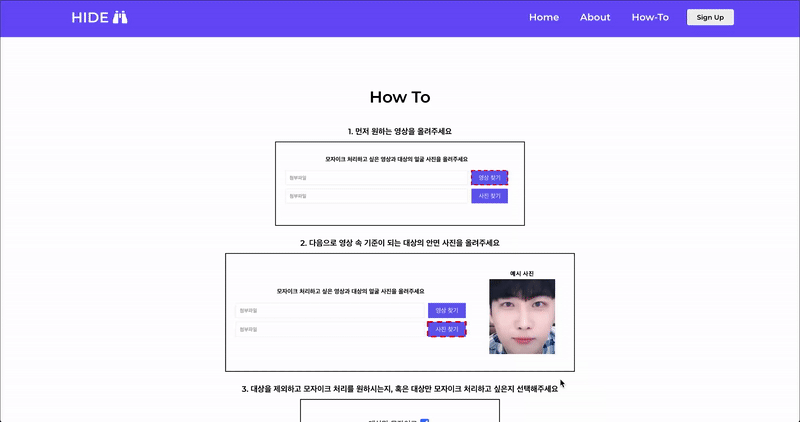
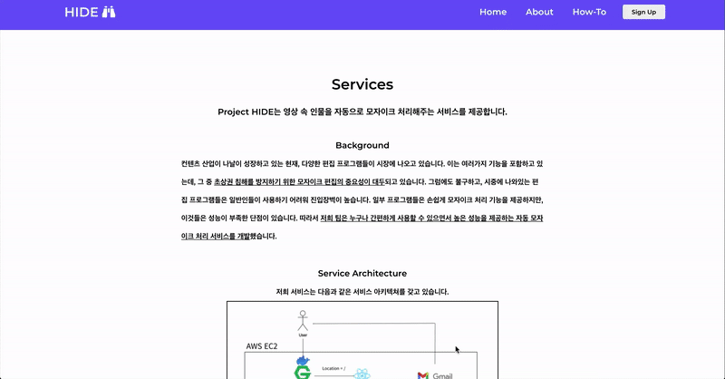

# Frontend 

## Introduction

    서강대학교 인공지능 캡스톤 디자인 HIDE 프로젝트 frontend 구현 repository입니다. 
    간략하게 프로젝트 설명을 하자면, project HIDE는 "Human Identification and Detection
    for Erasing"의 약자로, 영상 속 인물을 자동으로 모자이크 처리해주는 서비스 구현이
    목적입니다. 

 

## Goal

    - Main Goal: 사용자가 업로드한 영상, 사진, 옵션 정보를 받아서 서버에 넘길 수 있는 웹 구현 
    - Functions  
        1. File Upload - by. useState, input tag, axios
        2. Page Navigating - by. Router 
        3. Navbar
        

 

## Stack
    - Programming Language : HTML, CSS, JS
    - Framework : React JS
    - Packages : react-router-dom, react-loader-spinner, axios

 

## Service Result 

 

### 1. 제출 예시 

(제출에 실패하게 되면 아래에 실패 문구 표시)

 

### 2. How To Page

 

### 3. Services 
